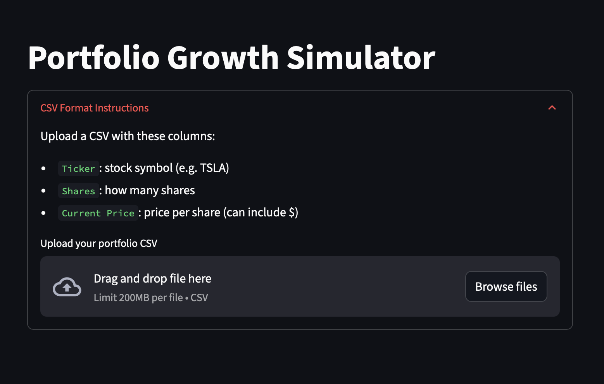
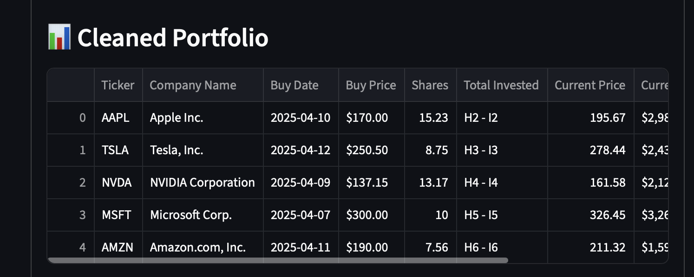
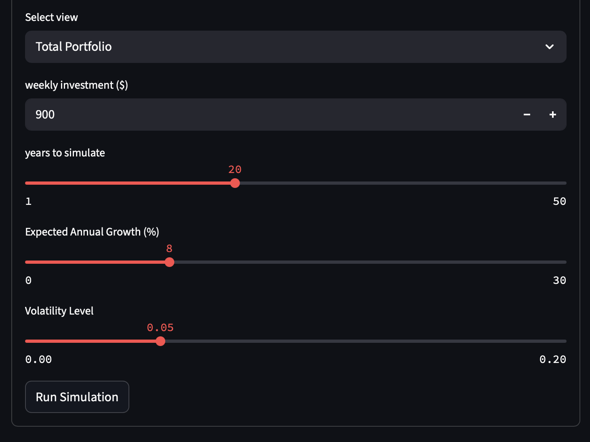
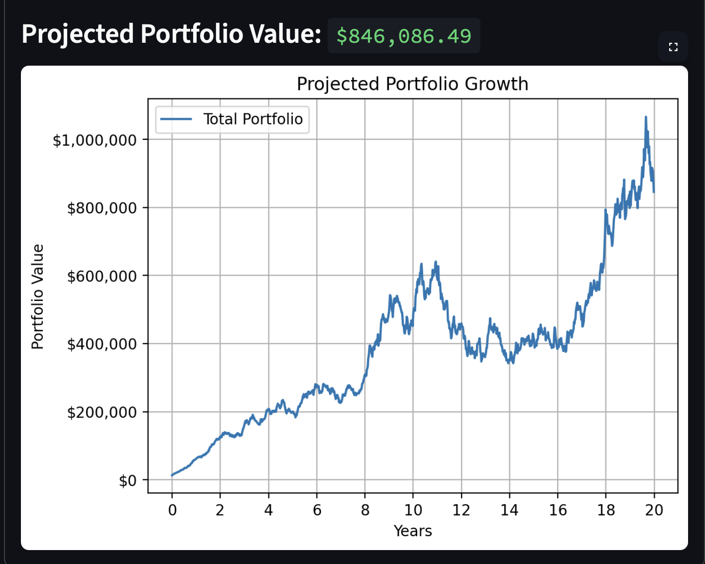

# 📈 Portfolio Growth Simulator


A Streamlit web app that simulates long-term investment growth using compound interest, weekly contributions, and market volatility.

---

## 🖼 App Screenshots

**CSV Upload Interface** 
**Cleaned Portfolio View** 
**Simulation Settings Panel** 
**Portfolio Growth Chart** 


---

## 🧠 How It Works

1. Upload your portfolio as a CSV file
2. Set your weekly investment amount, expected annual growth rate, and volatility level
3. The app simulates future value using compound growth and optional market randomness
4. Choose to view either the full portfolio or individual stock projections
5. Results are visualized in an interactive chart with projected final values

---

## 🚀 Features

- Upload your stock portfolio as a CSV  
- Adjust growth %, volatility, and contribution amount  
- View total portfolio or single stock projections  
- See raw, cleaned, and dropped data  
- Visualize compound growth across multiple years  
- (Coming soon) Export projection results  

---

## 📄 Sample Portfolio CSV

Use this file to test the app:  
[👉 sample_portfolio_with_values.csv](./sample_portfolio_with_values.csv)

---

```csv
Ticker,Shares,Current Price
AAPL,10,195.12
MSFT,5,410.23
TSLA,8,870.50
```
## 📦 How to Run

```bash
git clone https://github.com/JorgeF123/portfolio-growth-simulator.git
cd portfolio-growth-simulator
pip install -r requirements.txt
streamlit run main.py
```
## 👨‍💻 About Me

Hi, I'm Jorge a self-taught developer and student with a strong interest in data, investing, and building useful tools.  
- 🔗 GitHub: [JorgeF123](https://github.com/JorgeF123)  
- 📫 Email: jorgefloresramires01@gmail.com

